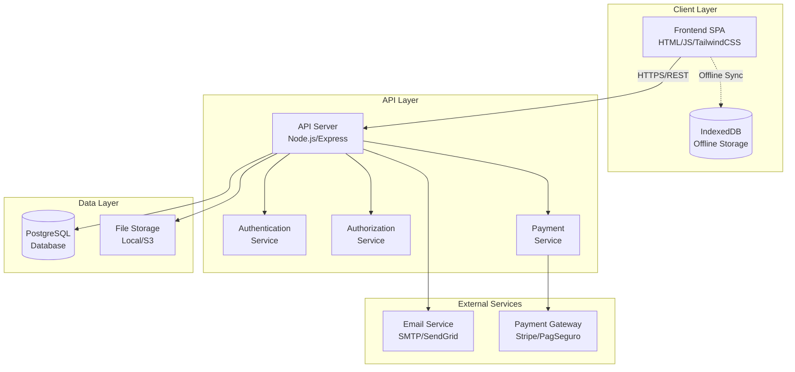
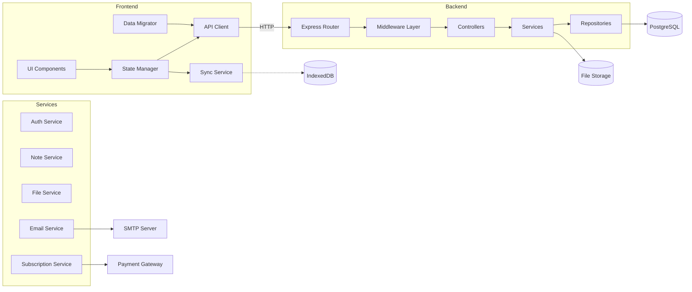
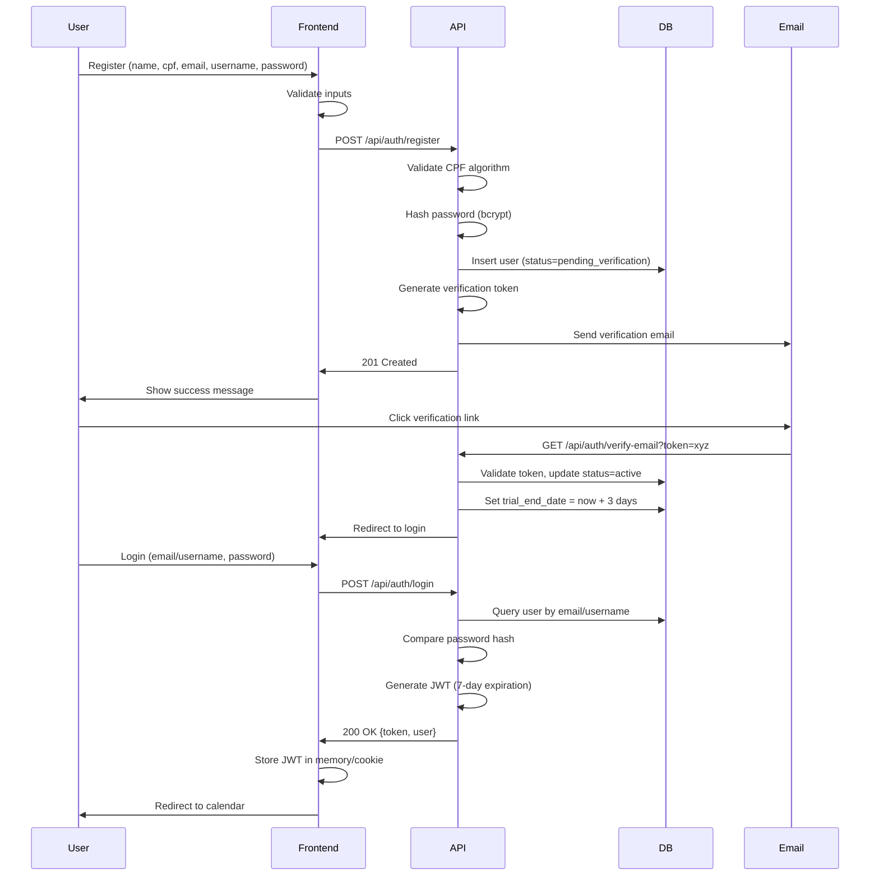
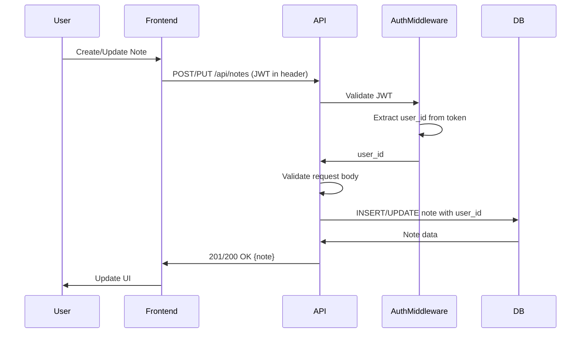
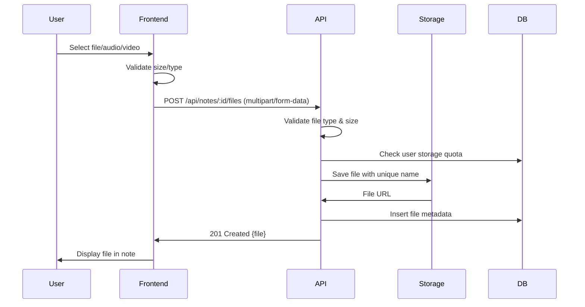

# Design Document: Multi-User Authentication System for AgendaDiaria

## Overview

This design transforms AgendaDiaria from a single-user application with local IndexedDB storage into a multi-user system with authentication, RESTful backend API, and persistent database storage. The system enables multiple users to create accounts, login securely, maintain independent data, synchronize across devices, and comply with LGPD requirements.

### Key Features
- User registration with full profile (name, CPF, email, username, password)
- Email verification and authentication via JWT
- 3-day trial period after email confirmation
- Subscription system with monthly/annual plans
- Payment gateway integration (Stripe/PagSeguro/Mercado Pago)
- Media upload (files, audio, video) with 100MB quota
- Data migration from IndexedDB to server
- Offline support with automatic sync
- LGPD-compliant data export and account deletion

### Architecture Overview

**Architecture Style:** Monolithic backend with separated frontend (client-server)

The system follows a three-tier architecture:





### Technology Stack

**Frontend:**
- Single-Page Application (SPA) with vanilla JavaScript
- TailwindCSS via CDN for styling
- IndexedDB for offline storage and sync queue
- MediaRecorder API for audio/video recording

**Backend:**
- **Runtime:** Node.js 18+ LTS
- **Framework:** Express.js 4.x
- **Authentication:** jsonwebtoken (JWT), bcrypt (password hashing)
- **Validation:** joi or express-validator
- **File Upload:** multer
- **Email:** nodemailer with SMTP or SendGrid

**Database:**
- **PostgreSQL 14+** with connection pooling (pg/pg-pool)
- Indexes on user_id, date, createdAt for performance
- Row-level security for data isolation

**Storage:**
- Local filesystem for development
- AWS S3 or compatible service for production
- Signed URLs for secure file access

**Payment Gateway:**
- Primary: Stripe (international)
- Alternative: PagSeguro or Mercado Pago (Brazil)

---

## Architecture

### Component Diagram




### Data Flow

**Authentication Flow:**




**Note CRUD Flow:**



**File Upload Flow:**



---

## Components and Interfaces

### Frontend Components

**1. AuthenticationModule**
- Registration form with validation
- Login form with email/username support
- Password reset flow
- Email verification handler
- JWT token management

**2. CalendarModule** (existing, to be modified)
- Date navigation and selection
- Note indicators on calendar
- Integrates with API instead of IndexedDB

**3. NoteEditorModule** (existing, to be modified)
- Rich text content editing
- Tag management
- Link management
- File/audio/video upload

**4. SyncService**
- Detects online/offline status
- Queues changes when offline
- Syncs to API when online
- Implements exponential backoff retry

**5. DataMigrationService**
- Reads existing IndexedDB data
- Batches notes for upload (50 per batch)
- Tracks migration progress
- Clears local data on success

**6. SubscriptionModule** (new)
- Displays trial countdown
- Payment method registration
- Plan selection (monthly/annual)
- Payment history view


### Backend Components

**1. Authentication Service**

```typescript
interface IAuthService {
  register(userData: RegisterDTO): Promise<User>;
  verifyEmail(token: string): Promise<boolean>;
  login(identifier: string, password: string): Promise<{token: string, user: User}>;
  resetPassword(email: string): Promise<void>;
  confirmPasswordReset(token: string, newPassword: string): Promise<void>;
  validateToken(token: string): Promise<User>;
}

interface RegisterDTO {
  full_name: string;
  cpf: string;
  email: string;
  username: string;
  password: string;
}
```

**2. Authorization Service**

```typescript
interface IAuthorizationService {
  verifyResourceOwnership(userId: string, resourceId: string, resourceType: string): Promise<boolean>;
  checkSubscriptionStatus(userId: string): Promise<SubscriptionStatus>;
  checkStorageQuota(userId: string, additionalBytes: number): Promise<boolean>;
}
```

**3. Note Service**

```typescript
interface INoteService {
  create(userId: string, noteData: CreateNoteDTO): Promise<Note>;
  findById(userId: string, noteId: string): Promise<Note | null>;
  findAll(userId: string, filters?: NoteFilter): Promise<Note[]>;
  update(userId: string, noteId: string, noteData: UpdateNoteDTO): Promise<Note>;
  delete(userId: string, noteId: string): Promise<void>;
  search(userId: string, query: SearchQuery): Promise<PaginatedResult<Note>>;
}

interface CreateNoteDTO {
  date: string;
  title: string;
  content: string;
  tags: string[];
  links: Link[];
}

interface NoteFilter {
  dateFrom?: string;
  dateTo?: string;
  tags?: string[];
}

interface SearchQuery {
  query?: string;
  tags?: string[];
  dateFrom?: string;
  dateTo?: string;
  page: number;
  limit: number;
  sortBy: 'relevance' | 'date';
}
```


**4. File Service**

```typescript
interface IFileService {
  uploadFile(userId: string, noteId: string, file: FileUpload): Promise<FileMetadata>;
  uploadAudio(userId: string, noteId: string, audio: FileUpload): Promise<FileMetadata>;
  uploadVideo(userId: string, noteId: string, video: FileUpload): Promise<FileMetadata>;
  getFileUrl(userId: string, fileId: string): Promise<string>;
  deleteFile(userId: string, fileId: string): Promise<void>;
  getUserStorageUsage(userId: string): Promise<number>;
}

interface FileUpload {
  buffer: Buffer;
  originalName: string;
  mimetype: string;
  size: number;
}

interface FileMetadata {
  id: string;
  noteId: string;
  userId: string;
  filename: string;
  originalName: string;
  mimetype: string;
  size: number;
  url: string;
  type: 'file' | 'audio' | 'video';
  createdAt: Date;
}
```

**5. Subscription Service**

```typescript
interface ISubscriptionService {
  registerPaymentMethod(userId: string, paymentToken: string): Promise<PaymentMethod>;
  subscribe(userId: string, planId: 'monthly' | 'annual'): Promise<Subscription>;
  getSubscription(userId: string): Promise<Subscription | null>;
  getPaymentHistory(userId: string): Promise<Payment[]>;
  cancelSubscription(userId: string): Promise<void>;
  processRenewal(subscriptionId: string): Promise<boolean>;
  checkAndUpdateTrialStatus(userId: string): Promise<void>;
}

interface PaymentMethod {
  id: string;
  userId: string;
  type: 'credit_card';
  last4: string;
  expiryMonth: number;
  expiryYear: number;
  gatewayToken: string;
}

interface Subscription {
  id: string;
  userId: string;
  plan: 'monthly' | 'annual';
  status: 'trial' | 'active' | 'cancelled' | 'expired';
  trialStartDate: Date | null;
  trialEndDate: Date | null;
  startDate: Date;
  endDate: Date;
  renewalDate: Date;
  cancellationDate: Date | null;
}

interface Payment {
  id: string;
  userId: string;
  subscriptionId: string;
  amount: number;
  currency: string;
  status: 'pending' | 'completed' | 'failed' | 'refunded';
  gatewayTransactionId: string;
  createdAt: Date;
}
```


**6. Email Service**

```typescript
interface IEmailService {
  sendVerificationEmail(user: User, token: string): Promise<void>;
  sendPasswordResetEmail(user: User, token: string): Promise<void>;
  sendTrialExpiringEmail(user: User, daysRemaining: number): Promise<void>;
  sendSubscriptionConfirmationEmail(user: User, subscription: Subscription): Promise<void>;
  sendPaymentFailedEmail(user: User, payment: Payment): Promise<void>;
  sendAccountDeletionEmail(user: User, cancellationToken: string): Promise<void>;
}
```

---

## Data Models

### Database Schema (PostgreSQL)

```sql
-- Users Table
CREATE TABLE users (
    id UUID PRIMARY KEY DEFAULT gen_random_uuid(),
    full_name VARCHAR(255) NOT NULL,
    cpf_encrypted TEXT NOT NULL UNIQUE,
    email VARCHAR(255) NOT NULL UNIQUE,
    username VARCHAR(20) NOT NULL UNIQUE,
    password_hash TEXT NOT NULL,
    status VARCHAR(50) NOT NULL DEFAULT 'pending_verification',
    trial_start_date TIMESTAMP,
    trial_end_date TIMESTAMP,
    created_at TIMESTAMP NOT NULL DEFAULT NOW(),
    updated_at TIMESTAMP NOT NULL DEFAULT NOW(),
    deleted_at TIMESTAMP,
    CONSTRAINT username_format CHECK (username ~ '^[a-zA-Z0-9_-]{3,20}$')
);

CREATE INDEX idx_users_email ON users(email);
CREATE INDEX idx_users_username ON users(username);
CREATE INDEX idx_users_status ON users(status);

-- Email Tokens Table
CREATE TABLE email_tokens (
    id UUID PRIMARY KEY DEFAULT gen_random_uuid(),
    user_id UUID NOT NULL REFERENCES users(id) ON DELETE CASCADE,
    token TEXT NOT NULL UNIQUE,
    type VARCHAR(50) NOT NULL, -- 'email_verification', 'password_reset', 'account_deletion'
    expires_at TIMESTAMP NOT NULL,
    used_at TIMESTAMP,
    created_at TIMESTAMP NOT NULL DEFAULT NOW()
);

CREATE INDEX idx_email_tokens_token ON email_tokens(token);
CREATE INDEX idx_email_tokens_user_id ON email_tokens(user_id);

-- Notes Table
CREATE TABLE notes (
    id UUID PRIMARY KEY DEFAULT gen_random_uuid(),
    user_id UUID NOT NULL REFERENCES users(id) ON DELETE CASCADE,
    date DATE NOT NULL,
    title VARCHAR(500),
    content TEXT,
    tags TEXT[], -- PostgreSQL array of strings
    created_at TIMESTAMP NOT NULL DEFAULT NOW(),
    updated_at TIMESTAMP NOT NULL DEFAULT NOW()
);

CREATE INDEX idx_notes_user_id ON notes(user_id);
CREATE INDEX idx_notes_date ON notes(date);
CREATE INDEX idx_notes_user_date ON notes(user_id, date);
CREATE INDEX idx_notes_tags ON notes USING GIN(tags); -- For tag search
CREATE INDEX idx_notes_content ON notes USING GIN(to_tsvector('portuguese', content)); -- Full-text search

-- Links Table (one-to-many with notes)
CREATE TABLE links (
    id UUID PRIMARY KEY DEFAULT gen_random_uuid(),
    note_id UUID NOT NULL REFERENCES notes(id) ON DELETE CASCADE,
    url TEXT NOT NULL,
    title VARCHAR(500),
    description TEXT,
    created_at TIMESTAMP NOT NULL DEFAULT NOW()
);

CREATE INDEX idx_links_note_id ON links(note_id);

-- Media Files Table
CREATE TABLE media_files (
    id UUID PRIMARY KEY DEFAULT gen_random_uuid(),
    note_id UUID NOT NULL REFERENCES notes(id) ON DELETE CASCADE,
    user_id UUID NOT NULL REFERENCES users(id) ON DELETE CASCADE,
    file_type VARCHAR(20) NOT NULL, -- 'file', 'audio', 'video'
    filename VARCHAR(500) NOT NULL,
    original_name VARCHAR(500) NOT NULL,
    mimetype VARCHAR(100) NOT NULL,
    size_bytes BIGINT NOT NULL,
    storage_url TEXT NOT NULL,
    created_at TIMESTAMP NOT NULL DEFAULT NOW()
);

CREATE INDEX idx_media_files_note_id ON media_files(note_id);
CREATE INDEX idx_media_files_user_id ON media_files(user_id);
CREATE INDEX idx_media_files_type ON media_files(file_type);
```


```sql
-- Subscriptions Table
CREATE TABLE subscriptions (
    id UUID PRIMARY KEY DEFAULT gen_random_uuid(),
    user_id UUID NOT NULL REFERENCES users(id) ON DELETE CASCADE,
    plan VARCHAR(50) NOT NULL, -- 'monthly', 'annual'
    status VARCHAR(50) NOT NULL DEFAULT 'trial', -- 'trial', 'active', 'cancelled', 'expired'
    trial_start_date TIMESTAMP,
    trial_end_date TIMESTAMP,
    start_date TIMESTAMP NOT NULL,
    end_date TIMESTAMP NOT NULL,
    renewal_date TIMESTAMP NOT NULL,
    cancellation_date TIMESTAMP,
    created_at TIMESTAMP NOT NULL DEFAULT NOW(),
    updated_at TIMESTAMP NOT NULL DEFAULT NOW(),
    UNIQUE(user_id) -- One subscription per user
);

CREATE INDEX idx_subscriptions_user_id ON subscriptions(user_id);
CREATE INDEX idx_subscriptions_status ON subscriptions(status);
CREATE INDEX idx_subscriptions_renewal_date ON subscriptions(renewal_date);

-- Payment Methods Table
CREATE TABLE payment_methods (
    id UUID PRIMARY KEY DEFAULT gen_random_uuid(),
    user_id UUID NOT NULL REFERENCES users(id) ON DELETE CASCADE,
    type VARCHAR(50) NOT NULL DEFAULT 'credit_card',
    last4 VARCHAR(4) NOT NULL,
    expiry_month INTEGER NOT NULL,
    expiry_year INTEGER NOT NULL,
    gateway_token TEXT NOT NULL, -- Encrypted token from payment gateway
    is_default BOOLEAN DEFAULT true,
    created_at TIMESTAMP NOT NULL DEFAULT NOW(),
    updated_at TIMESTAMP NOT NULL DEFAULT NOW()
);

CREATE INDEX idx_payment_methods_user_id ON payment_methods(user_id);

-- Payments Table
CREATE TABLE payments (
    id UUID PRIMARY KEY DEFAULT gen_random_uuid(),
    user_id UUID NOT NULL REFERENCES users(id) ON DELETE CASCADE,
    subscription_id UUID REFERENCES subscriptions(id) ON DELETE SET NULL,
    amount DECIMAL(10, 2) NOT NULL,
    currency VARCHAR(3) NOT NULL DEFAULT 'BRL',
    status VARCHAR(50) NOT NULL DEFAULT 'pending', -- 'pending', 'completed', 'failed', 'refunded'
    gateway_transaction_id TEXT,
    gateway_response TEXT, -- JSON response from gateway
    created_at TIMESTAMP NOT NULL DEFAULT NOW(),
    updated_at TIMESTAMP NOT NULL DEFAULT NOW()
);

CREATE INDEX idx_payments_user_id ON payments(user_id);
CREATE INDEX idx_payments_subscription_id ON payments(subscription_id);
CREATE INDEX idx_payments_status ON payments(status);
CREATE INDEX idx_payments_created_at ON payments(created_at);

-- Audit Logs Table (LGPD compliance)
CREATE TABLE audit_logs (
    id UUID PRIMARY KEY DEFAULT gen_random_uuid(),
    user_id UUID REFERENCES users(id) ON DELETE SET NULL,
    action VARCHAR(100) NOT NULL, -- 'data_export', 'account_deletion', 'login', 'failed_login'
    ip_address INET,
    user_agent TEXT,
    metadata JSONB,
    created_at TIMESTAMP NOT NULL DEFAULT NOW()
);

CREATE INDEX idx_audit_logs_user_id ON audit_logs(user_id);
CREATE INDEX idx_audit_logs_action ON audit_logs(action);
CREATE INDEX idx_audit_logs_created_at ON audit_logs(created_at);
```


### API Endpoints

**Authentication Endpoints:**

```
POST   /api/auth/register
POST   /api/auth/login
POST   /api/auth/verify-email
POST   /api/auth/resend-verification
POST   /api/auth/reset-password
POST   /api/auth/confirm-reset-password
POST   /api/auth/logout
GET    /api/auth/me
```

**Note Endpoints:**

```
GET    /api/notes
POST   /api/notes
GET    /api/notes/:id
PUT    /api/notes/:id
DELETE /api/notes/:id
GET    /api/notes/search
GET    /api/notes/by-date/:date
```

**Media Endpoints:**

```
POST   /api/notes/:id/files
POST   /api/notes/:id/audio
POST   /api/notes/:id/video
GET    /api/files/:id
DELETE /api/files/:id
GET    /api/users/me/storage
```

**Subscription Endpoints:**

```
POST   /api/subscription/payment-method
GET    /api/subscription/payment-methods
DELETE /api/subscription/payment-method/:id
POST   /api/subscription/subscribe
GET    /api/subscription
POST   /api/subscription/cancel
GET    /api/subscription/history
```

**User Endpoints:**

```
GET    /api/users/me
PUT    /api/users/me
DELETE /api/users/me
GET    /api/export
```

---

## Critical Algorithms

### 1. CPF Validation Algorithm

CPF (Cadastro de Pessoa Física) is an 11-digit Brazilian tax identification number with two check digits.

**Algorithm:**

```
function validateCPF(cpf: string): boolean
  // Remove formatting (dots, dashes)
  cpf = removeNonDigits(cpf)
  
  // Must be exactly 11 digits
  if cpf.length != 11 then
    return false
  
  // Reject known invalid CPFs (all same digit)
  if allDigitsSame(cpf) then
    return false
  
  // Calculate first check digit
  sum1 = 0
  for i from 0 to 8 do
    sum1 = sum1 + digit(cpf, i) * (10 - i)
  remainder1 = sum1 mod 11
  checkDigit1 = (remainder1 < 2) ? 0 : (11 - remainder1)
  
  // Verify first check digit
  if digit(cpf, 9) != checkDigit1 then
    return false
  
  // Calculate second check digit
  sum2 = 0
  for i from 0 to 9 do
    sum2 = sum2 + digit(cpf, i) * (11 - i)
  remainder2 = sum2 mod 11
  checkDigit2 = (remainder2 < 2) ? 0 : (11 - remainder2)
  
  // Verify second check digit
  if digit(cpf, 10) != checkDigit2 then
    return false
  
  return true

function removeNonDigits(str: string): string
  return str.replace(/\D/g, '')

function allDigitsSame(str: string): boolean
  return str.split('').every(d => d == str[0])

function digit(str: string, index: number): number
  return parseInt(str.charAt(index), 10)
```

**Example:**
- Valid CPF: `123.456.789-09` → returns `true`
- Invalid CPF: `123.456.789-00` → returns `false`
- Invalid CPF: `111.111.111-11` → returns `false` (all same digit)


### 2. Trial Period Checker

Checks if a user's trial period is active, expiring soon, or expired.

```
function checkTrialStatus(user: User): TrialStatus
  if user.subscription.status != 'trial' then
    return {active: false, expired: false, daysRemaining: 0}
  
  now = currentTimestamp()
  trialEnd = user.subscription.trial_end_date
  
  if now > trialEnd then
    return {active: false, expired: true, daysRemaining: 0}
  
  millisecondsRemaining = trialEnd - now
  daysRemaining = ceil(millisecondsRemaining / (24 * 60 * 60 * 1000))
  
  return {
    active: true,
    expired: false,
    daysRemaining: daysRemaining,
    expiringSoon: daysRemaining <= 1
  }

interface TrialStatus {
  active: boolean;
  expired: boolean;
  daysRemaining: number;
  expiringSoon?: boolean;
}
```

### 3. Storage Quota Calculator

Ensures users don't exceed 100MB storage limit.

```
function checkStorageQuota(userId: string, newFileSize: number): Promise<boolean>
  currentUsage = await db.query(
    'SELECT COALESCE(SUM(size_bytes), 0) as total 
     FROM media_files 
     WHERE user_id = $1',
    [userId]
  )
  
  totalBytes = currentUsage.total + newFileSize
  quotaBytes = 100 * 1024 * 1024  // 100MB in bytes
  
  return totalBytes <= quotaBytes

function getUserStorageUsage(userId: string): Promise<StorageInfo>
  result = await db.query(
    'SELECT COALESCE(SUM(size_bytes), 0) as used_bytes,
            COUNT(*) as file_count
     FROM media_files 
     WHERE user_id = $1',
    [userId]
  )
  
  quotaBytes = 100 * 1024 * 1024
  usedBytes = result.used_bytes
  
  return {
    usedBytes: usedBytes,
    quotaBytes: quotaBytes,
    usedMB: usedBytes / (1024 * 1024),
    quotaMB: 100,
    percentUsed: (usedBytes / quotaBytes) * 100,
    remainingBytes: quotaBytes - usedBytes,
    fileCount: result.file_count
  }
```


### 4. Conflict Resolution (Last-Write-Wins)

Handles sync conflicts when offline changes conflict with server state.

```
function resolveConflict(localNote: Note, serverNote: Note): Note
  // Compare timestamps
  if localNote.updated_at > serverNote.updated_at then
    // Local changes are newer
    return localNote
  else if localNote.updated_at < serverNote.updated_at then
    // Server changes are newer
    return serverNote
  else
    // Exact same timestamp (unlikely) - prefer server
    return serverNote

function syncNote(localNote: Note): Promise<SyncResult>
  try
    // Fetch current server version
    serverNote = await api.get(`/api/notes/${localNote.id}`)
    
    if serverNote.updated_at > localNote.updated_at then
      // Server has newer version
      return {
        status: 'conflict',
        resolution: 'server_wins',
        note: serverNote
      }
    
    // Local version is newer or same, push to server
    updatedNote = await api.put(`/api/notes/${localNote.id}`, localNote)
    
    return {
      status: 'success',
      note: updatedNote
    }
    
  catch NotFoundError
    // Note deleted on server
    return {
      status: 'deleted_on_server',
      note: null
    }
  
  catch NetworkError as e
    // Network issue, retry later
    return {
      status: 'failed',
      error: e,
      retryable: true
    }
```

### 5. Migration from IndexedDB

Migrates existing local data to the server in batches.

```
function migrateFromIndexedDB(userId: string): Promise<MigrationResult>
  localNotes = await indexedDB.notes.getAll()
  
  if localNotes.length == 0 then
    return {success: true, migrated: 0, failed: 0}
  
  totalNotes = localNotes.length
  migrated = 0
  failed = 0
  batchSize = 50
  
  // Process in batches
  for i from 0 to totalNotes step batchSize do
    batch = localNotes.slice(i, i + batchSize)
    
    try
      // Send batch to server
      result = await api.post('/api/notes/batch', {notes: batch})
      migrated = migrated + result.successCount
      failed = failed + result.failedCount
      
      // Update progress
      progress = (i + batch.length) / totalNotes * 100
      updateUI(progress, migrated, failed)
      
    catch error
      // Batch failed, mark all as failed
      failed = failed + batch.length
      logError('Migration batch failed', error)
  
  if failed == 0 then
    // Success, clear local data
    await indexedDB.notes.clear()
    await indexedDB.media.clear()
    
  return {
    success: failed == 0,
    totalNotes: totalNotes,
    migrated: migrated,
    failed: failed
  }
```


### 6. Automatic Payment Renewal

Processes recurring subscription payments.

```
function processRenewal(subscriptionId: string): Promise<boolean>
  subscription = await db.subscriptions.findById(subscriptionId)
  user = await db.users.findById(subscription.user_id)
  paymentMethod = await db.paymentMethods.findDefault(user.id)
  
  if !paymentMethod then
    await emailService.sendPaymentMethodMissingEmail(user)
    return false
  
  // Calculate amount based on plan
  amount = subscription.plan == 'monthly' ? 29.90 : 299.00
  
  // Attempt payment through gateway
  maxRetries = 3
  retryDelay = [0, 24 * 60 * 60 * 1000, 72 * 60 * 60 * 1000] // 0h, 24h, 72h
  
  for attempt from 1 to maxRetries do
    try
      paymentResult = await paymentGateway.charge({
        amount: amount,
        currency: 'BRL',
        paymentMethod: paymentMethod.gateway_token,
        description: `AgendaDiaria ${subscription.plan} subscription`
      })
      
      if paymentResult.status == 'success' then
        // Payment succeeded
        await db.payments.create({
          user_id: user.id,
          subscription_id: subscription.id,
          amount: amount,
          status: 'completed',
          gateway_transaction_id: paymentResult.transaction_id
        })
        
        // Extend subscription period
        newEndDate = addMonthsOrYear(subscription.end_date, subscription.plan)
        newRenewalDate = newEndDate
        
        await db.subscriptions.update(subscription.id, {
          end_date: newEndDate,
          renewal_date: newRenewalDate,
          updated_at: now()
        })
        
        await emailService.sendPaymentSuccessEmail(user, amount)
        return true
      
      else
        // Payment failed, log and retry
        await db.payments.create({
          user_id: user.id,
          subscription_id: subscription.id,
          amount: amount,
          status: 'failed',
          gateway_transaction_id: paymentResult.transaction_id
        })
        
        if attempt < maxRetries then
          // Schedule retry
          await scheduleRetry(subscriptionId, retryDelay[attempt])
        else
          // All retries exhausted
          await db.subscriptions.update(subscription.id, {
            status: 'expired',
            updated_at: now()
          })
          await emailService.sendPaymentFailedEmail(user)
          return false
    
    catch error
      logError('Payment processing error', error)
      if attempt == maxRetries then
        return false

function addMonthsOrYear(date: Date, plan: string): Date
  if plan == 'monthly' then
    return addMonths(date, 1)
  else if plan == 'annual' then
    return addYears(date, 1)
```

---

## Correctness Properties


*A property is a characteristic or behavior that should hold true across all valid executions of a system—essentially, a formal statement about what the system should do. Properties serve as the bridge between human-readable specifications and machine-verifiable correctness guarantees.*

### Property Reflection

After analyzing the acceptance criteria, I identified the following testable properties:

**Potential Properties:**
1. Password validation (1.3)
2. Password hash comparison (3.3)
3. JWT user_id extraction (6.2)
4. Data isolation filtering (6.3)
5. Note field validation (7.6)
6. File type validation (9.3)
7. Storage quota enforcement (9.6)
8. Date range search filtering (11.2)
9. JSON parsing (18.1)
10. Export-import round-trip (18.4)
11. CPF validation (23.5, 23.6)
12. Trial period calculation (24.1)
13. Trial status transition (24.6)
14. Subscription renewal date calculation (25.10)

**Redundancy Analysis:**
- Properties 23.5 and 23.6 (CPF validation) can be combined into one comprehensive property about CPF validation
- Property 18.1 (JSON parsing) is subsumed by property 18.4 (round-trip), since successful round-trip implies successful parsing
- Properties 6.2 and 6.3 both relate to data isolation and can be combined into one comprehensive property

**Final Properties (after eliminating redundancy):**
1. Password validation
2. Password verification (hash comparison)
3. Data isolation (combined JWT extraction + filtering)
4. Note field validation
5. File type validation
6. Storage quota enforcement
7. Date range search filtering
8. Export-import-export round-trip
9. CPF validation (combined algorithm verification)
10. Trial period calculation
11. Trial status transition
12. Subscription renewal date calculation

---

### Property 1: Password Validation

*For any* string input, the password validator SHALL correctly accept passwords that meet security requirements (8+ characters, 1 uppercase, 1 lowercase, 1 number) and reject passwords that do not meet these requirements.

**Validates: Requirements 1.3**

### Property 2: Password Verification

*For any* valid password string, after hashing with bcrypt, comparing the original password against the hash SHALL return true, and comparing any different password against the hash SHALL return false.

**Validates: Requirements 3.3**

### Property 3: Data Isolation

*For any* authenticated user and any query, the API SHALL return only notes where the note's user_id matches the authenticated user's user_id extracted from the JWT token, never returning notes belonging to other users.

**Validates: Requirements 6.2, 6.3**

### Property 4: Note Field Validation

*For any* note data submitted to the API, the validator SHALL correctly accept notes with valid field types (string title, string content, string array tags, link array links) and reject notes with invalid field types or missing required fields.

**Validates: Requirements 7.6**

### Property 5: File Type Validation

*For any* file upload, the validator SHALL accept files with mimetypes in the allowed list (jpg, png, gif, webp, pdf, docx, txt, zip, webm, mp3, wav, m4a, mp4) and reject files with mimetypes not in the allowed list.

**Validates: Requirements 9.3**


### Property 6: Storage Quota Enforcement

*For any* user and any sequence of file uploads, the total storage used SHALL never exceed 100MB, and any upload that would cause the total to exceed 100MB SHALL be rejected with error.

**Validates: Requirements 9.6**

### Property 7: Date Range Search Filtering

*For any* date range query (date_from, date_to) and any collection of notes, all notes returned by the search SHALL have a date field that falls within the specified range (date >= date_from AND date <= date_to).

**Validates: Requirements 11.2**

### Property 8: Export-Import-Export Round-Trip

*For any* valid collection of notes, exporting the data to JSON, then importing the JSON, then exporting again SHALL produce JSON that is semantically equivalent to the original export (same notes, same data, potentially different ordering).

**Validates: Requirements 18.4**

### Property 9: CPF Validation

*For any* 11-digit string (with or without formatting), the CPF validator SHALL correctly calculate both check digits using the Brazilian CPF algorithm and return true if both check digits match, false otherwise, and SHALL reject CPFs where all digits are the same.

**Validates: Requirements 23.5, 23.6**

### Property 10: Trial Period Calculation

*For any* email verification timestamp, setting the trial_end_date SHALL result in a timestamp exactly 72 hours (3 days * 24 hours * 60 minutes * 60 seconds * 1000 milliseconds) after the verification timestamp.

**Validates: Requirements 24.1**

### Property 11: Trial Status Transition

*For any* subscription with status "trial", when the current timestamp exceeds trial_end_date, the subscription status SHALL be updated to "expired" and access to features SHALL be blocked except for data export and subscription management.

**Validates: Requirements 24.6**

### Property 12: Subscription Renewal Date Calculation

*For any* subscription end date and plan type, calculating the renewal date SHALL add exactly 1 month for monthly plans or exactly 1 year for annual plans to the end date, correctly handling month boundaries and leap years.

**Validates: Requirements 25.10**

---

## Error Handling

### Error Response Format

All API errors follow this consistent JSON format:

```json
{
  "error": "ERROR_CODE",
  "message": "Human-readable error message",
  "details": {
    "field": "specific field information (optional)"
  }
}
```


### HTTP Status Codes

| Status Code | Meaning | Use Case |
|-------------|---------|----------|
| 200 | OK | Successful GET, PUT, DELETE |
| 201 | Created | Successful POST (resource created) |
| 204 | No Content | Successful DELETE with no response body |
| 400 | Bad Request | Invalid input, validation errors |
| 401 | Unauthorized | Missing or invalid authentication token |
| 403 | Forbidden | Valid authentication but insufficient permissions |
| 404 | Not Found | Resource doesn't exist |
| 409 | Conflict | Resource already exists (duplicate email, username, CPF) |
| 413 | Payload Too Large | File upload exceeds size limits or storage quota |
| 429 | Too Many Requests | Rate limit exceeded |
| 500 | Internal Server Error | Unexpected server error |
| 503 | Service Unavailable | Temporary service disruption |

### Error Categories

**1. Validation Errors (400)**

```json
{
  "error": "VALIDATION_ERROR",
  "message": "Input validation failed",
  "details": {
    "password": "Password must contain at least 8 characters, 1 uppercase, 1 lowercase, and 1 number",
    "email": "Invalid email format"
  }
}
```

**2. Authentication Errors (401)**

```json
{
  "error": "INVALID_CREDENTIALS",
  "message": "Email/username or password is incorrect"
}
```

```json
{
  "error": "TOKEN_EXPIRED",
  "message": "Authentication token has expired. Please login again."
}
```

**3. Authorization Errors (403)**

```json
{
  "error": "SUBSCRIPTION_EXPIRED",
  "message": "Your subscription has expired. Please renew to continue using the service.",
  "details": {
    "trial_ended": true,
    "can_export": true
  }
}
```

```json
{
  "error": "INSUFFICIENT_PERMISSIONS",
  "message": "You do not have permission to access this resource"
}
```

**4. Resource Errors (404, 409)**

```json
{
  "error": "NOTE_NOT_FOUND",
  "message": "Note with id 'abc-123' not found"
}
```

```json
{
  "error": "EMAIL_ALREADY_EXISTS",
  "message": "An account with this email already exists"
}
```

```json
{
  "error": "CPF_ALREADY_REGISTERED",
  "message": "This CPF is already registered to another account"
}
```

**5. Storage Errors (413)**

```json
{
  "error": "STORAGE_QUOTA_EXCEEDED",
  "message": "Upload would exceed your 100MB storage limit",
  "details": {
    "current_usage_mb": 95.5,
    "quota_mb": 100,
    "file_size_mb": 8.2,
    "remaining_mb": 4.5
  }
}
```

**6. Rate Limiting (429)**

```json
{
  "error": "RATE_LIMIT_EXCEEDED",
  "message": "Too many requests. Please try again in 15 minutes.",
  "details": {
    "retry_after_seconds": 900
  }
}
```


### Error Logging Strategy

**Frontend:**
- Log all API errors to browser console with context
- Display user-friendly error messages in UI
- Track error frequency for monitoring

**Backend:**
- Log all 500 errors with full stack traces
- Log security events (failed logins, unauthorized access)
- Log payment processing errors with transaction IDs
- Store logs in structured format (JSON) for analysis

**Monitoring:**
- Alert on error rate spikes (> 5% of requests)
- Alert on authentication failure spikes (potential attack)
- Alert on payment processing failures
- Track error distribution by endpoint and status code

---

## Testing Strategy

### Testing Approach

The testing strategy employs a **dual testing approach** combining property-based testing for universal properties with example-based unit tests for specific scenarios.

### Unit Testing

**Focus Areas:**
- Specific examples demonstrating correct behavior
- Integration points between components
- Edge cases and error conditions
- UI interaction flows
- Database query correctness

**Test Organization:**
```
tests/
  unit/
    services/
      auth.service.test.js
      note.service.test.js
      file.service.test.js
      subscription.service.test.js
    validators/
      cpf.validator.test.js
      password.validator.test.js
      note.validator.test.js
    utils/
      date.utils.test.js
      storage.utils.test.js
  integration/
    api/
      auth.api.test.js
      notes.api.test.js
      subscription.api.test.js
    database/
      repositories.test.js
  property/
    auth.property.test.js
    validation.property.test.js
    data-isolation.property.test.js
    storage.property.test.js
```

### Property-Based Testing

**Library:** fast-check (JavaScript property-based testing library)

**Configuration:**
- Minimum 100 iterations per property test
- Each property test references its design document property
- Tag format: `Feature: multi-user-authentication, Property {number}: {property_text}`


**Property Test Implementation Examples:**

```javascript
// tests/property/validation.property.test.js
const fc = require('fast-check');
const { validatePassword } = require('../../src/validators/password');

describe('Property 1: Password Validation', () => {
  test('Feature: multi-user-authentication, Property 1: Password validation correctly classifies all strings', () => {
    fc.assert(
      fc.property(
        fc.string({ minLength: 0, maxLength: 50 }),
        (password) => {
          const hasMinLength = password.length >= 8;
          const hasUppercase = /[A-Z]/.test(password);
          const hasLowercase = /[a-z]/.test(password);
          const hasNumber = /[0-9]/.test(password);
          
          const shouldBeValid = hasMinLength && hasUppercase && hasLowercase && hasNumber;
          const actuallyValid = validatePassword(password);
          
          return shouldBeValid === actuallyValid;
        }
      ),
      { numRuns: 100 }
    );
  });
});

// tests/property/cpf.property.test.js
const fc = require('fast-check');
const { validateCPF, calculateCheckDigits } = require('../../src/validators/cpf');

describe('Property 9: CPF Validation', () => {
  test('Feature: multi-user-authentication, Property 9: CPF validator correctly validates check digits', () => {
    fc.assert(
      fc.property(
        fc.array(fc.integer({ min: 0, max: 9 }), { minLength: 11, maxLength: 11 }),
        (digits) => {
          const cpfString = digits.join('');
          
          // Reject all same digits
          if (new Set(digits).size === 1) {
            return validateCPF(cpfString) === false;
          }
          
          // Calculate expected check digits
          const [expectedDigit1, expectedDigit2] = calculateCheckDigits(digits.slice(0, 9));
          
          // Create valid CPF
          const validCPF = [...digits.slice(0, 9), expectedDigit1, expectedDigit2].join('');
          
          // Should accept valid CPF
          const validResult = validateCPF(validCPF);
          
          // Should reject if we change last digit
          const invalidCPF = [...digits.slice(0, 10), (digits[10] + 1) % 10].join('');
          const invalidResult = validateCPF(invalidCPF);
          
          return validResult === true && invalidResult === false;
        }
      ),
      { numRuns: 100 }
    );
  });
});

// tests/property/data-isolation.property.test.js
const fc = require('fast-check');
const { NoteService } = require('../../src/services/note.service');
const { setupTestDatabase, teardownTestDatabase } = require('../helpers/db');

describe('Property 3: Data Isolation', () => {
  let noteService;
  
  beforeAll(async () => {
    await setupTestDatabase();
    noteService = new NoteService();
  });
  
  afterAll(async () => {
    await teardownTestDatabase();
  });
  
  test('Feature: multi-user-authentication, Property 3: Users only see their own notes', async () => {
    await fc.assert(
      fc.asyncProperty(
        fc.array(fc.uuid(), { minLength: 2, maxLength: 5 }), // user IDs
        fc.array(fc.record({ // notes
          title: fc.string({ minLength: 1, maxLength: 100 }),
          content: fc.string({ maxLength: 500 }),
          date: fc.date({ min: new Date('2024-01-01'), max: new Date('2025-12-31') })
            .map(d => d.toISOString().split('T')[0])
        }), { minLength: 5, maxLength: 20 }),
        async (userIds, notesData) => {
          // Assign notes to users randomly
          const notes = notesData.map(noteData => ({
            ...noteData,
            userId: userIds[Math.floor(Math.random() * userIds.length)]
          }));
          
          // Save all notes
          for (const note of notes) {
            await noteService.create(note.userId, note);
          }
          
          // Verify each user only sees their own notes
          for (const userId of userIds) {
            const userNotes = await noteService.findAll(userId);
            const allBelongToUser = userNotes.every(note => note.userId === userId);
            if (!allBelongToUser) return false;
          }
          
          return true;
        }
      ),
      { numRuns: 100 }
    );
  }, 30000); // Increase timeout for async property tests
});
```


### Integration Testing

**Scope:**
- Full API endpoint workflows
- Database operations with real PostgreSQL test instance
- File upload and storage
- Email service integration (with mock SMTP)
- Payment gateway integration (with test/sandbox mode)

**Tools:**
- Supertest for HTTP endpoint testing
- Test database instance (Docker PostgreSQL)
- Jest or Mocha test framework

**Example Integration Test:**

```javascript
// tests/integration/api/auth.api.test.js
const request = require('supertest');
const app = require('../../src/app');
const { setupTestDatabase, clearTestDatabase } = require('../helpers/db');

describe('Authentication API Integration', () => {
  beforeAll(async () => {
    await setupTestDatabase();
  });
  
  beforeEach(async () => {
    await clearTestDatabase();
  });
  
  describe('POST /api/auth/register', () => {
    test('should register user with valid data', async () => {
      const userData = {
        full_name: 'João da Silva',
        cpf: '123.456.789-09',
        email: 'joao@example.com',
        username: 'joaosilva',
        password: 'Senha123!'
      };
      
      const response = await request(app)
        .post('/api/auth/register')
        .send(userData)
        .expect(201);
      
      expect(response.body).toHaveProperty('id');
      expect(response.body.email).toBe(userData.email);
      expect(response.body.status).toBe('pending_verification');
    });
    
    test('should reject registration with invalid CPF', async () => {
      const userData = {
        full_name: 'João da Silva',
        cpf: '111.111.111-11', // Invalid CPF (all same digits)
        email: 'joao@example.com',
        username: 'joaosilva',
        password: 'Senha123!'
      };
      
      const response = await request(app)
        .post('/api/auth/register')
        .send(userData)
        .expect(400);
      
      expect(response.body.error).toBe('VALIDATION_ERROR');
      expect(response.body.details).toHaveProperty('cpf');
    });
    
    test('should reject duplicate email', async () => {
      const userData = {
        full_name: 'João da Silva',
        cpf: '123.456.789-09',
        email: 'joao@example.com',
        username: 'joaosilva',
        password: 'Senha123!'
      };
      
      // First registration
      await request(app).post('/api/auth/register').send(userData).expect(201);
      
      // Duplicate registration
      const response = await request(app)
        .post('/api/auth/register')
        .send({ ...userData, username: 'joaosilva2', cpf: '987.654.321-00' })
        .expect(409);
      
      expect(response.body.error).toBe('EMAIL_ALREADY_EXISTS');
    });
  });
});
```


### End-to-End Testing

**Scope:**
- Complete user journeys from frontend to backend
- Browser automation for UI interactions
- Multi-step workflows (registration → verification → login → usage)

**Tools:**
- Playwright or Cypress for browser automation
- Test against deployed staging environment

**Key E2E Scenarios:**
1. Complete registration and email verification flow
2. Login, create notes, upload files, logout
3. Password reset flow
4. Data migration from IndexedDB
5. Trial expiration and subscription flow
6. Offline mode and sync

### Performance Testing

**Metrics:**
- API response time (p50, p95, p99)
- Database query time
- Throughput (requests per second)
- Concurrent users capacity

**Targets:**
- GET /api/notes: < 200ms (p95)
- POST /api/notes: < 300ms (p95)
- Search queries: < 500ms (p95)
- File upload: Depends on size, but processing < 1s for 10MB
- Support 100 concurrent users

**Tools:**
- Artillery or k6 for load testing
- PostgreSQL EXPLAIN ANALYZE for query optimization

### Security Testing

**Areas:**
- SQL injection attempts
- XSS attempts in note content
- JWT token tampering
- Brute force login attempts (rate limiting)
- CSRF protection
- File upload malicious payloads

**Tools:**
- OWASP ZAP or Burp Suite for vulnerability scanning
- npm audit for dependency vulnerabilities
- Manual penetration testing

---

## Security Design

### Authentication Security

**Password Storage:**
- Algorithm: bcrypt with cost factor 12
- Never store plain text passwords
- Salt is handled automatically by bcrypt

```javascript
const bcrypt = require('bcrypt');
const SALT_ROUNDS = 12;

async function hashPassword(plainPassword) {
  return await bcrypt.hash(plainPassword, SALT_ROUNDS);
}

async function verifyPassword(plainPassword, hash) {
  return await bcrypt.compare(plainPassword, hash);
}
```

**JWT Token Structure:**

```json
{
  "header": {
    "alg": "HS256",
    "typ": "JWT"
  },
  "payload": {
    "userId": "uuid-here",
    "email": "user@example.com",
    "username": "username",
    "iat": 1640000000,
    "exp": 1640604800
  }
}
```

- Signing algorithm: HMAC SHA256 (HS256)
- Secret key: Stored in environment variable, minimum 256 bits
- Expiration: 7 days from issuance
- Refresh: Auto-refresh when within 24 hours of expiration


### HTTPS/TLS Configuration

**Requirements:**
- TLS 1.2 minimum, TLS 1.3 preferred
- Valid SSL certificate (Let's Encrypt for free option)
- Force HTTPS redirect for all HTTP requests
- HSTS header with 1-year max-age

**Express Configuration:**

```javascript
// Production: Use reverse proxy (nginx) for SSL termination
// Development: Use self-signed certificate

if (process.env.NODE_ENV === 'production') {
  app.use((req, res, next) => {
    if (req.header('x-forwarded-proto') !== 'https') {
      res.redirect(`https://${req.header('host')}${req.url}`);
    } else {
      next();
    }
  });
}
```

### Security Headers

```javascript
const helmet = require('helmet');

app.use(helmet({
  contentSecurityPolicy: {
    directives: {
      defaultSrc: ["'self'"],
      styleSrc: ["'self'", "'unsafe-inline'", "https://cdn.jsdelivr.net"],
      scriptSrc: ["'self'", "https://cdn.jsdelivr.net"],
      imgSrc: ["'self'", "data:", "https:"],
      connectSrc: ["'self'"],
      fontSrc: ["'self'", "https://fonts.gstatic.com"],
      objectSrc: ["'none'"],
      mediaSrc: ["'self'"],
      frameSrc: ["'none'"],
    },
  },
  hsts: {
    maxAge: 31536000, // 1 year
    includeSubDomains: true,
    preload: true
  },
  referrerPolicy: { policy: "strict-origin-when-cross-origin" }
}));

app.use((req, res, next) => {
  res.setHeader('X-Content-Type-Options', 'nosniff');
  res.setHeader('X-Frame-Options', 'DENY');
  res.setHeader('X-XSS-Protection', '1; mode=block');
  next();
});
```

### CORS Configuration

```javascript
const cors = require('cors');

const ALLOWED_ORIGINS = [
  'https://agendadiaria.com',
  'https://www.agendadiaria.com',
  process.env.NODE_ENV === 'development' ? 'http://localhost:3000' : null
].filter(Boolean);

app.use(cors({
  origin: function(origin, callback) {
    if (!origin || ALLOWED_ORIGINS.includes(origin)) {
      callback(null, true);
    } else {
      callback(new Error('Not allowed by CORS'));
    }
  },
  credentials: true,
  methods: ['GET', 'POST', 'PUT', 'DELETE'],
  allowedHeaders: ['Content-Type', 'Authorization']
}));
```

### Input Validation and Sanitization

**Strategy:**
- Validate all inputs at API boundary
- Sanitize HTML content to prevent XSS
- Use parameterized queries to prevent SQL injection
- Validate file uploads (type, size, content)

```javascript
const { body, param, query, validationResult } = require('express-validator');
const sanitizeHtml = require('sanitize-html');

// Validation middleware example
const validateNoteCreation = [
  body('title').trim().isLength({ max: 500 }).escape(),
  body('content').trim().customSanitizer(value => {
    return sanitizeHtml(value, {
      allowedTags: ['b', 'i', 'em', 'strong', 'a', 'p', 'br'],
      allowedAttributes: {
        'a': ['href']
      }
    });
  }),
  body('tags').isArray().custom(tags => {
    return tags.every(tag => typeof tag === 'string' && tag.length <= 50);
  }),
  body('date').isISO8601().toDate(),
  (req, res, next) => {
    const errors = validationResult(req);
    if (!errors.isEmpty()) {
      return res.status(400).json({
        error: 'VALIDATION_ERROR',
        message: 'Input validation failed',
        details: errors.mapped()
      });
    }
    next();
  }
];
```


### Rate Limiting

**Configuration:**

```javascript
const rateLimit = require('express-rate-limit');

// General API rate limit
const apiLimiter = rateLimit({
  windowMs: 60 * 1000, // 1 minute
  max: 100, // 100 requests per minute per IP
  message: {
    error: 'RATE_LIMIT_EXCEEDED',
    message: 'Too many requests. Please try again later.',
  },
  standardHeaders: true,
  legacyHeaders: false,
});

// Stricter limit for authentication endpoints
const authLimiter = rateLimit({
  windowMs: 15 * 60 * 1000, // 15 minutes
  max: 5, // 5 attempts per 15 minutes
  skipSuccessfulRequests: true,
  message: {
    error: 'RATE_LIMIT_EXCEEDED',
    message: 'Too many login attempts. Please try again in 15 minutes.',
  }
});

app.use('/api/', apiLimiter);
app.use('/api/auth/login', authLimiter);
app.use('/api/auth/register', authLimiter);
app.use('/api/auth/reset-password', authLimiter);
```

### CPF Encryption

CPF is sensitive personal data under LGPD and must be encrypted at rest.

```javascript
const crypto = require('crypto');

const ENCRYPTION_KEY = process.env.CPF_ENCRYPTION_KEY; // 32 bytes hex string
const ALGORITHM = 'aes-256-gcm';

function encryptCPF(cpf) {
  const iv = crypto.randomBytes(16);
  const cipher = crypto.createCipheriv(ALGORITHM, Buffer.from(ENCRYPTION_KEY, 'hex'), iv);
  
  let encrypted = cipher.update(cpf, 'utf8', 'hex');
  encrypted += cipher.final('hex');
  
  const authTag = cipher.getAuthTag();
  
  // Store iv + authTag + encrypted data
  return iv.toString('hex') + ':' + authTag.toString('hex') + ':' + encrypted;
}

function decryptCPF(encryptedData) {
  const parts = encryptedData.split(':');
  const iv = Buffer.from(parts[0], 'hex');
  const authTag = Buffer.from(parts[1], 'hex');
  const encrypted = parts[2];
  
  const decipher = crypto.createDecipheriv(ALGORITHM, Buffer.from(ENCRYPTION_KEY, 'hex'), iv);
  decipher.setAuthTag(authTag);
  
  let decrypted = decipher.update(encrypted, 'hex', 'utf8');
  decrypted += decipher.final('utf8');
  
  return decrypted;
}
```

---

## Performance Design

### Database Indexing Strategy

**Indexes Created:**

```sql
-- Users table
CREATE INDEX idx_users_email ON users(email);
CREATE INDEX idx_users_username ON users(username);
CREATE INDEX idx_users_status ON users(status);

-- Notes table
CREATE INDEX idx_notes_user_id ON notes(user_id);
CREATE INDEX idx_notes_date ON notes(date);
CREATE INDEX idx_notes_user_date ON notes(user_id, date); -- Composite for user+date queries
CREATE INDEX idx_notes_tags ON notes USING GIN(tags); -- Array index for tag search
CREATE INDEX idx_notes_content ON notes USING GIN(to_tsvector('portuguese', content)); -- Full-text

-- Media files
CREATE INDEX idx_media_files_user_id ON media_files(user_id);
CREATE INDEX idx_media_files_note_id ON media_files(note_id);

-- Subscriptions
CREATE INDEX idx_subscriptions_user_id ON subscriptions(user_id);
CREATE INDEX idx_subscriptions_renewal_date ON subscriptions(renewal_date); -- For cron jobs

-- Payments
CREATE INDEX idx_payments_user_id ON payments(user_id);
CREATE INDEX idx_payments_created_at ON payments(created_at); -- For history queries
```

**Query Optimization:**

```sql
-- Optimized query for user notes with date range
SELECT n.*, 
       COALESCE(json_agg(DISTINCT l.*) FILTER (WHERE l.id IS NOT NULL), '[]') as links,
       COALESCE(json_agg(DISTINCT m.*) FILTER (WHERE m.id IS NOT NULL), '[]') as media
FROM notes n
LEFT JOIN links l ON l.note_id = n.id
LEFT JOIN media_files m ON m.note_id = n.id
WHERE n.user_id = $1
  AND n.date BETWEEN $2 AND $3
GROUP BY n.id
ORDER BY n.date DESC
LIMIT $4 OFFSET $5;
```


### Connection Pooling

```javascript
const { Pool } = require('pg');

const pool = new Pool({
  host: process.env.DB_HOST,
  port: process.env.DB_PORT,
  database: process.env.DB_NAME,
  user: process.env.DB_USER,
  password: process.env.DB_PASSWORD,
  min: 5,  // Minimum connections in pool
  max: 20, // Maximum connections in pool
  idleTimeoutMillis: 30000,
  connectionTimeoutMillis: 2000,
});

pool.on('error', (err, client) => {
  console.error('Unexpected error on idle client', err);
  process.exit(-1);
});

module.exports = pool;
```

### Caching Strategy

**Redis Cache for:**
- User sessions (alternative to stateless JWT)
- Frequently accessed user metadata
- Search result caching (5-minute TTL)
- Rate limiting counters

**Example Redis Integration:**

```javascript
const redis = require('redis');
const client = redis.createClient({
  host: process.env.REDIS_HOST,
  port: process.env.REDIS_PORT,
  password: process.env.REDIS_PASSWORD
});

client.on('error', (err) => console.error('Redis Client Error', err));

async function getCachedNotes(userId, cacheKey) {
  const cached = await client.get(cacheKey);
  if (cached) {
    return JSON.parse(cached);
  }
  
  const notes = await db.notes.findByUserId(userId);
  await client.setEx(cacheKey, 300, JSON.stringify(notes)); // 5 min TTL
  
  return notes;
}

async function invalidateUserCache(userId) {
  const pattern = `notes:${userId}:*`;
  const keys = await client.keys(pattern);
  if (keys.length > 0) {
    await client.del(keys);
  }
}
```

### File Storage Strategy

**Development:**
- Local filesystem storage in `uploads/` directory
- Organized by user_id: `uploads/{user_id}/files/`, `uploads/{user_id}/audio/`, `uploads/{user_id}/video/`

**Production:**
- AWS S3 or compatible object storage (DigitalOcean Spaces, Backblaze B2)
- Signed URLs for secure file access (1-hour expiration)
- CDN integration for faster delivery

**S3 Configuration Example:**

```javascript
const AWS = require('aws-sdk');

const s3 = new AWS.S3({
  accessKeyId: process.env.AWS_ACCESS_KEY_ID,
  secretAccessKey: process.env.AWS_SECRET_ACCESS_KEY,
  region: process.env.AWS_REGION
});

const BUCKET_NAME = process.env.S3_BUCKET_NAME;

async function uploadToS3(userId, file, fileType) {
  const key = `${userId}/${fileType}/${Date.now()}-${file.originalname}`;
  
  const params = {
    Bucket: BUCKET_NAME,
    Key: key,
    Body: file.buffer,
    ContentType: file.mimetype,
    ServerSideEncryption: 'AES256'
  };
  
  const result = await s3.upload(params).promise();
  return result.Location;
}

async function getSignedUrl(key) {
  const params = {
    Bucket: BUCKET_NAME,
    Key: key,
    Expires: 3600 // 1 hour
  };
  
  return s3.getSignedUrl('getObject', params);
}

async function deleteFromS3(key) {
  const params = {
    Bucket: BUCKET_NAME,
    Key: key
  };
  
  await s3.deleteObject(params).promise();
}
```

---

## Deployment Architecture

### Infrastructure Components

```
┌─────────────────────────────────────────────────┐
│                  Cloud Provider                  │
│                 (AWS/DO/Azure)                   │
├─────────────────────────────────────────────────┤
│                                                  │
│  ┌──────────────┐        ┌──────────────┐      │
│  │    CDN       │        │  Load        │      │
│  │  CloudFlare  │───────▶│  Balancer    │      │
│  └──────────────┘        └──────┬───────┘      │
│                                  │              │
│         ┌────────────────────────┼────────┐     │
│         │                        │        │     │
│    ┌────▼─────┐           ┌─────▼────┐   │     │
│    │  Web     │           │   Web    │   │     │
│    │  Server  │           │  Server  │   │     │
│    │  (Node)  │           │  (Node)  │   │     │
│    └────┬─────┘           └─────┬────┘   │     │
│         │                       │        │     │
│         └───────────┬───────────┘        │     │
│                     │                    │     │
│         ┌───────────▼──────────┐         │     │
│         │   PostgreSQL         │         │     │
│         │   (Primary+Replica)  │         │     │
│         └──────────────────────┘         │     │
│                                          │     │
│         ┌──────────────────────┐         │     │
│         │   Redis Cache        │         │     │
│         └──────────────────────┘         │     │
│                                          │     │
│         ┌──────────────────────┐         │     │
│         │   S3 Object Storage  │         │     │
│         └──────────────────────┘         │     │
│                                          │     │
└──────────────────────────────────────────┘     │
```


### Environment Configuration

**Environment Variables:**

```bash
# Application
NODE_ENV=production
PORT=3000
APP_URL=https://agendadiaria.com

# Database
DB_HOST=postgres.example.com
DB_PORT=5432
DB_NAME=agendadiaria
DB_USER=app_user
DB_PASSWORD=secure_password_here

# Redis
REDIS_HOST=redis.example.com
REDIS_PORT=6379
REDIS_PASSWORD=redis_password_here

# JWT
JWT_SECRET=256_bit_random_secret_here
JWT_EXPIRATION=7d

# Encryption
CPF_ENCRYPTION_KEY=32_byte_hex_key_here

# Email
SMTP_HOST=smtp.sendgrid.net
SMTP_PORT=587
SMTP_USER=apikey
SMTP_PASSWORD=sendgrid_api_key
EMAIL_FROM=noreply@agendadiaria.com

# Storage
STORAGE_TYPE=s3  # or 'local' for development
AWS_ACCESS_KEY_ID=your_access_key
AWS_SECRET_ACCESS_KEY=your_secret_key
AWS_REGION=us-east-1
S3_BUCKET_NAME=agendadiaria-files

# Payment Gateway
PAYMENT_GATEWAY=stripe  # or 'pagseguro' or 'mercadopago'
STRIPE_SECRET_KEY=sk_test_...
STRIPE_WEBHOOK_SECRET=whsec_...

# Monitoring
SENTRY_DSN=https://...@sentry.io/...
LOG_LEVEL=info
```

### Monitoring and Logging

**Application Monitoring:**
- Error tracking: Sentry or Rollbar
- Performance monitoring: New Relic or Datadog
- Uptime monitoring: Pingdom or UptimeRobot

**Logging Strategy:**

```javascript
const winston = require('winston');

const logger = winston.createLogger({
  level: process.env.LOG_LEVEL || 'info',
  format: winston.format.combine(
    winston.format.timestamp(),
    winston.format.errors({ stack: true }),
    winston.format.json()
  ),
  defaultMeta: { service: 'agendadiaria-api' },
  transports: [
    new winston.transports.File({ filename: 'logs/error.log', level: 'error' }),
    new winston.transports.File({ filename: 'logs/combined.log' }),
  ],
});

if (process.env.NODE_ENV !== 'production') {
  logger.add(new winston.transports.Console({
    format: winston.format.simple(),
  }));
}

module.exports = logger;
```

**Key Metrics to Monitor:**
- Request rate and response time
- Error rate (5xx responses)
- Database query performance
- Storage usage per user
- Subscription conversion rate
- Payment success/failure rate
- Active user count

### Backup Strategy

**Database Backups:**
- Automated daily backups
- Retention: 30 days
- Point-in-time recovery capability
- Backup verification weekly

**File Storage Backups:**
- S3 versioning enabled
- Cross-region replication for disaster recovery

---

## LGPD Compliance

### Data Processing Principles

1. **Purpose Limitation:** Data collected only for user authentication and note management
2. **Data Minimization:** Only essential data collected (name, CPF, email, username, password, notes)
3. **Transparency:** Clear privacy policy explaining data usage
4. **Security:** Encryption in transit (HTTPS) and at rest (database encryption, CPF encryption)
5. **Data Subject Rights:** Export and deletion capabilities

### User Rights Implementation

| Right | Implementation |
|-------|----------------|
| Access | GET /api/export provides all user data |
| Rectification | PUT /api/users/me allows profile updates |
| Erasure | DELETE /api/users/me with 7-day grace period |
| Portability | JSON export in standard format |
| Objection | User can delete account at any time |

### Consent Management

**Registration Consent:**

```html
<form id="register-form">
  <!-- form fields -->
  
  <div class="consent-section">
    <label>
      <input type="checkbox" id="consent-data-processing" required>
      Li e aceito a <a href="/privacy-policy">Política de Privacidade</a> 
      e autorizo o processamento dos meus dados pessoais conforme descrito.
    </label>
    
    <label>
      <input type="checkbox" id="consent-terms" required>
      Li e aceito os <a href="/terms">Termos de Uso</a> do AgendaDiaria.
    </label>
  </div>
  
  <button type="submit">Criar Conta</button>
</form>
```

**Consent Record:**

```sql
CREATE TABLE consent_records (
    id UUID PRIMARY KEY DEFAULT gen_random_uuid(),
    user_id UUID NOT NULL REFERENCES users(id) ON DELETE CASCADE,
    consent_type VARCHAR(100) NOT NULL, -- 'data_processing', 'terms_of_service'
    consent_text TEXT NOT NULL, -- Snapshot of policy at time of consent
    ip_address INET,
    user_agent TEXT,
    granted_at TIMESTAMP NOT NULL DEFAULT NOW()
);
```

### Privacy Policy Requirements

The privacy policy must include:
- Data controller identification (company name, address, contact)
- Types of personal data collected
- Purpose of data processing
- Legal basis for processing (user consent, contract)
- Data retention period
- User rights under LGPD (access, rectification, erasure, portability)
- Data security measures
- Data sharing practices (none for this application)
- Contact information for data protection officer (if applicable)
- Last updated date

### Audit Trail

```sql
-- Already defined in schema
CREATE TABLE audit_logs (
    id UUID PRIMARY KEY DEFAULT gen_random_uuid(),
    user_id UUID REFERENCES users(id) ON DELETE SET NULL,
    action VARCHAR(100) NOT NULL,
    ip_address INET,
    user_agent TEXT,
    metadata JSONB,
    created_at TIMESTAMP NOT NULL DEFAULT NOW()
);
```

**Audited Actions:**
- User login
- Failed login attempts
- Data export
- Account deletion request
- Account deletion cancellation
- Consent granted
- Profile updates

---

## Migration Path from Current System

### Phase 1: Backend Development
1. Set up project structure and dependencies
2. Implement database schema
3. Implement authentication service
4. Implement API endpoints
5. Implement file upload service
6. Implement subscription and payment service

### Phase 2: Frontend Modifications
1. Add authentication UI (login, register, password reset)
2. Modify existing calendar and editor to use API
3. Implement sync service for offline support
4. Implement migration tool for IndexedDB data

### Phase 3: Testing and Deployment
1. Write unit, integration, and property-based tests
2. Perform security audit
3. Set up production infrastructure
4. Deploy to staging for beta testing
5. Deploy to production with monitoring

### Phase 4: User Migration
1. Announce new multi-user system to existing users
2. Provide migration guide and support
3. Run old and new systems in parallel for transition period
4. Deprecate old system after successful migration

---

## Conclusion

This design provides a comprehensive blueprint for transforming AgendaDiaria into a robust multi-user system with authentication, persistent storage, subscription management, and LGPD compliance. The architecture balances security, performance, and user experience while maintaining the simplicity and elegance of the original application.

Key technical decisions:
- **Monolithic backend** for simplicity and rapid development
- **PostgreSQL** for relational data with JSONB for flexibility
- **JWT authentication** for stateless scalability
- **bcrypt** for password hashing
- **Property-based testing** for critical algorithms (CPF validation, data isolation, storage quota)
- **S3-compatible storage** for scalable file management
- **Stripe** as primary payment gateway with Brazilian alternatives

The system is designed to scale to thousands of users while maintaining fast response times, strong security, and full LGPD compliance.
